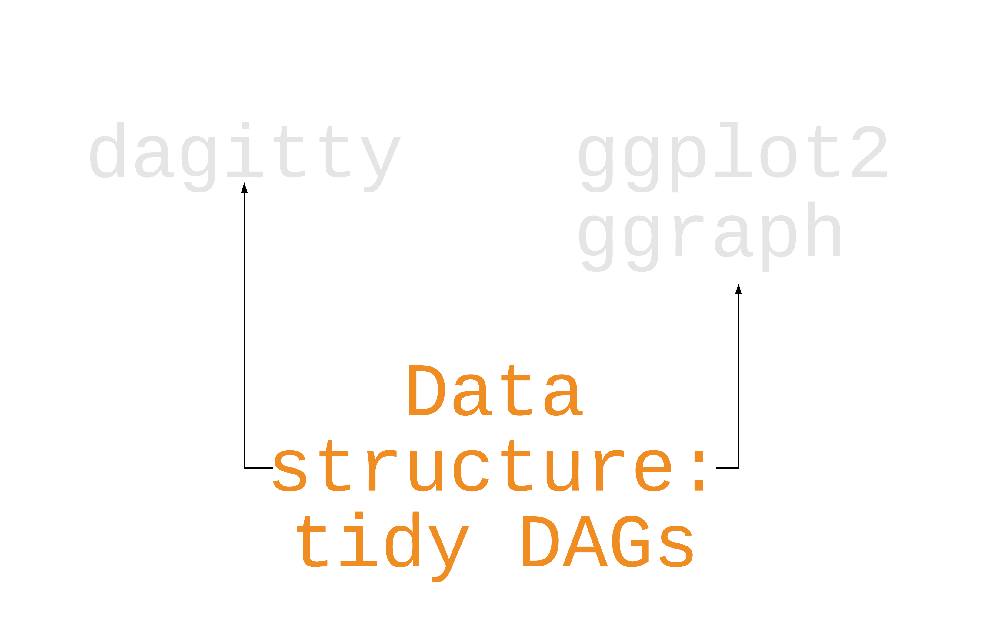
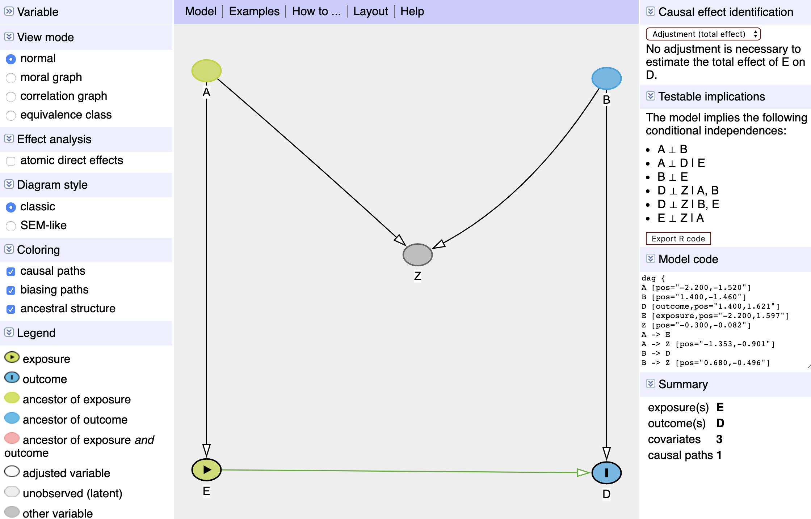

class: middle, center

```{r setup, include=FALSE}
options(htmltools.dir.version = FALSE, tibble.max_extra_cols = 6, tibble.width = 60)
knitr::opts_chunk$set(warning = FALSE, message = FALSE, fig.align = "center", dpi = 320, fig.height = 4.5)
library(tidyverse)
library(gapminder)
library(ggdag)
```

background-image: url(tellusaboutr.jpg)
background-size: cover

---

# **Our goal is to understand if `x` causes `y`**

```{r, echo=FALSE, fig.height=3, fig.width=4.5}
dagify(y ~ x, coords = data.frame(x = c(1, 2), y = c(1, 1), name = c("x", "y"))) %>% 
  ggdag() + theme_dag() + coord_fixed()
```

---

class: middle, center, inverse, 

# **All data is observational**


---

class: middle, center, inverse

# ~~All data is observational~~
# **but some data is better than others**

---

class: middle, center, inverse

# **We need to make assumptions**
---

class: middle, center, inverse

# ~~We need to make assumptions~~
# positivity
# consistency
# exchangeability 
---

class: middle, center, inverse

# ~~We need to make assumptions~~
# positivity
# consistency
# **exchangeability**

---

class: middle, center, inverse

# **Study design alleviates causal assumptions**

---

class: middle, center, inverse

# **Causal diagrams make our assumptions known**

---
class: middle, center

```{r, echo=FALSE}
dagitty::getExample("Shrier") %>% 
  tidy_dagitty() %>% 
  node_status() %>% 
  dag_adjustment_sets() %>% 
  filter(set == "{NeuromuscularFatigue, TissueWeakness}") %>% 
  ggplot(aes(x, y, xend = xend, yend = yend)) + 
  geom_dag_point(
    data = function(x) dplyr::filter(x, is.na(status)), color = "grey90", size = 4) +      
  geom_dag_point(
    data = function(x) dplyr::filter(x, !is.na(status)), color = "#E69F00", size = 4) + 
  geom_dag_edges_diagonal(aes(start_cap = ggraph::circle(.4), end_cap = ggraph::circle(.4)), edge_colour = "grey90") + 
  theme_dag() 
```

---
class: middle, center
```{r, echo=FALSE}
dagitty::getExample("Shrier") %>% 
  tidy_dagitty() %>% 
  node_status() %>% 
  dag_adjustment_sets() %>% 
  filter(set == "{NeuromuscularFatigue, TissueWeakness}") %>% 
  ggplot(aes(x, y, xend = xend, yend = yend)) + 
  geom_dag_point(
    data = function(x) dplyr::filter(x, is.na(status), adjusted == "unadjusted"), color = "grey90", size = 4) +      
  geom_dag_point(
    data = function(x) dplyr::filter(x, is.na(status), adjusted == "adjusted"), color = "#56B4E9", size = 4) + 
  geom_dag_point(
    data = function(x) dplyr::filter(x, !is.na(status)), color = "#E69F00", size = 4) + 
  geom_dag_edges_diagonal(aes(start_cap = ggraph::circle(.4), end_cap = ggraph::circle(.4)), edge_colour = "grey90") + 
  theme_dag() 
```

---

## Introducing ggdag

```{r, fig.height=4, eval=FALSE}
ggdag(confounder_triangle())
```

```{r, fig.height=4, echo=FALSE}
ggdag(confounder_triangle()) + coord_fixed()
```

---

```{r, echo=FALSE, out.width="100%", out.height="100%"}

```

---

```{r, echo=FALSE, out.width="100%", out.height="100%"}

```

---

```{r, echo=FALSE, out.width="100%", out.height="100%"}

```

---

```{r, echo=FALSE, out.width="100%", out.height="100%"}

```

---

```{r, eval=FALSE}
"dag {
x [exposure,pos=\"0.000,0.000\"]
y [outcome,pos=\"2.000,0.000\"]
z [pos=\"1.000,1.000\"]
z -> x
z -> y
}"
```

---

```{r, eval=FALSE}
"dag {
x [exposure,pos=\"0.000,0.000\"]
y [outcome,pos=\"2.000,0.000\"]
z [pos=\"1.000,1.000\"]
z -> x
z -> y
}" %>% 
  tidy_dagitty()
```
---

```{r, echo=FALSE}
"dag {
x [exposure,pos=\"0.000,0.000\"]
y [outcome,pos=\"2.000,0.000\"]
z [pos=\"1.000,1.000\"]
z -> x
z -> y
}" %>% 
  tidy_dagitty()
```

---

```{r, eval=FALSE}
confounder_triangle() %>% 
  dag_adjustment_sets() #<<
```

---

```{r, highlight.output = 13}
confounder_triangle() %>% 
  dag_adjustment_sets() 
```

---

```{r}
confounder_triangle() %>% 
  ggdag_adjustment_set()
```

---

```{r}
butterfly_bias() %>% 
  ggdag()
```

---

```{r}
butterfly_bias() %>% 
  ggdag_adjustment_set()
```

---

```{r}
butterfly_bias() %>% 
  ggdag_paths()
```

---

class: center, middle, inverse

# **ggdag returns ggplots**

---

```{r}
butterfly_bias() %>% 
  ggdag_paths() +
  theme_dag() #<<
```

---

```{r}
confounder_triangle() %>% 
  ggdag_classic() +  #<<
  theme_dag()
```


---

## Quick plots vs geoms

## `ggdag_*()`

--

## `geom_dag*()`

---

## Making DAGs

--

## Dagitty

---

```{r, echo=FALSE, out.width="100%", out.height="100%"}

```

---

## Making DAGs

## ~~Dagitty~~

## `dagify(y ~ x, x ~ z, y ~ z)`

---

class: center, middle, inverse

## **ggdag treats DAGs as data, linking dagitty and ggplot2**

---

class: inverse

# Vignettes

1. [An Introduction to ggdag](https://ggdag.malco.io/articles/intro-to-ggdag.html)
1. [An Introduction to Directed Acyclic Graphs](https://ggdag.malco.io/articles/intro-to-dags.html)
1. [Common Structures of Bias](https://ggdag.malco.io/articles/bias-structures.html)

---

class: center, middle, inverse

## [https://ggdag.malco.io](https://ggdag.malco.io/)

--

## **Thanks!**

